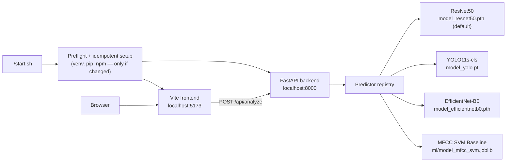
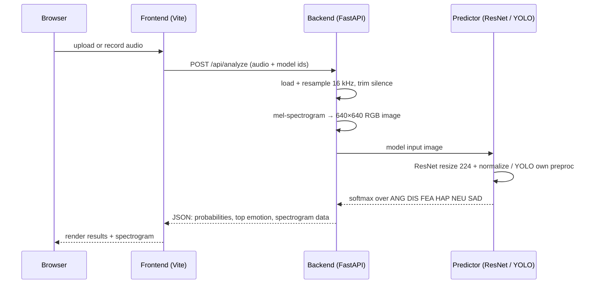

# Audio Emotion Analyzer

Upload or record speech and get emotion predictions visualized on a mel-spectrogram. React + Vite frontend, FastAPI backend running ResNet50 and YOLO11s-cls classifiers trained on CREMA-D.

## Prerequisites

- Python 3.8+
- Node.js 20+ (includes npm)

## Run

```bash
./start.sh
```

Linux and macOS run this directly. On Windows, run it inside [WSL](https://learn.microsoft.com/windows/wsl/install) (a normal Linux shell — `./start.sh` works unchanged there).

One command does everything: it creates a Python virtualenv and installs backend + frontend dependencies if they are missing or changed, then launches both servers. Re-run it any time — after `git pull` or a dependency change it reinstalls only what changed. Add `--reinstall` to force a clean reinstall.

Then open:

- Frontend: http://localhost:5173
- Backend API: http://localhost:8000 (interactive docs at `/docs`)

Press Ctrl+C to stop both.

## How it works

`start.sh` is the only entry point: it checks prerequisites, sets up the
backend venv and frontend packages only when they have changed, then runs
both servers together. Your browser talks to the Vite frontend, which calls
the FastAPI backend, which runs the audio through a trained classifier.



A single analysis request flows like this:



## Adding dependencies

Declare new dependencies in the manifest and commit them — backend in `SystemCode/backend/requirements.txt`, frontend via `npm install <pkg>` (updates `package.json` + `package-lock.json`). Teammates just re-run the start script; it detects the change and reinstalls automatically. An ad-hoc install that is not recorded in a manifest will not propagate.

## Project layout

```
SystemCode/
  backend/          FastAPI service + model inference
  frontend/         React + Vite UI
  data/training/    trained weights (model_resnet50.pth, model_yolo.pt, model_efficientnetb0.pt)
```

Component details: `SystemCode/backend/README.md`, `SystemCode/frontend/README.md`.

## Troubleshooting

- **Port 8000 or 5173 in use:** stop the process holding it (`lsof -ti:8000 | xargs kill` on Linux/macOS) and re-run.
- **"Missing model file":** the checkout is incomplete; ensure the repo, including tracked weights under `SystemCode/data/training/`, is fully pulled.
- **Dependency errors after a pull:** re-run with `--reinstall`.
